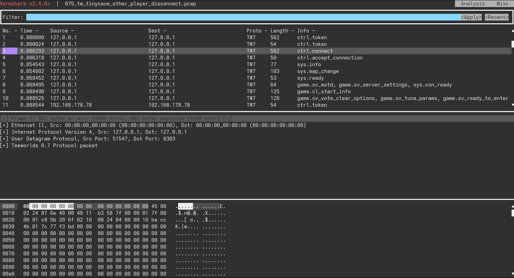

# Termshark
A terminal user-interface for tshark, inspired by Wireshark.

## This is a fork

Check out the original repository for the full readme https://github.com/gcla/termshark

## Quickstart

```
git clone https://github.com/ChillerDragon/termshark.git
cd termshark
export GO111MODULE=on
go generate ./... && go install ./...
~/go/bin/termshark
```

## What the fork does

I only changed the theme. Nothing exciting. I wanted it to look plain and dark.


